简体中文 | [English](README.md)

# LinkMind

LinkMind 是面向企业场景的多模态 AI 中间件，用来把业务系统、私有知识、模型厂商和 Agent 运行时统一接到一层可治理、可扩展、可上线的能力层里。它优先解决的是企业真正落地时最常见的几个问题：上手慢、接入碎、成本高、稳定性差。

## 在线 Demo

- 公网体验地址：[https://lagi.landingbj.com](https://lagi.landingbj.com/)
- 本地启动后的控制台地址：`http://localhost:8080`

## 项目简介

当前代码已经覆盖统一聊天入口、RAG、OCR、ASR/TTS、图片与视频能力、文档处理、Text-to-SQL、Embedding、Rerank、MCP、Skills、Worker 编排，以及 OpenAI 兼容接口。同时，项目还内置了 OpenClaw、Hermes Agent、DeerFlow 的配置同步能力，便于接入现有 Agent 工作流。

### 模型与运行时生态

<div style="display:flex;flex-wrap:wrap;gap:8px 10px;margin:12px 0 20px;">
  <span style="display:inline-flex;align-items:center;gap:8px;padding:6px 10px;border:1px solid #d0d7de;border-radius:999px;"><span>Landing</span></span>
  <span style="display:inline-flex;align-items:center;gap:8px;padding:6px 10px;border:1px solid #d0d7de;border-radius:999px;">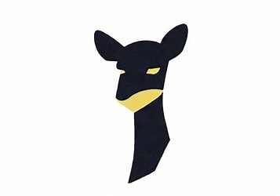<span>FastChat / Vicuna</span></span>
  <span style="display:inline-flex;align-items:center;gap:8px;padding:6px 10px;border:1px solid #d0d7de;border-radius:999px;">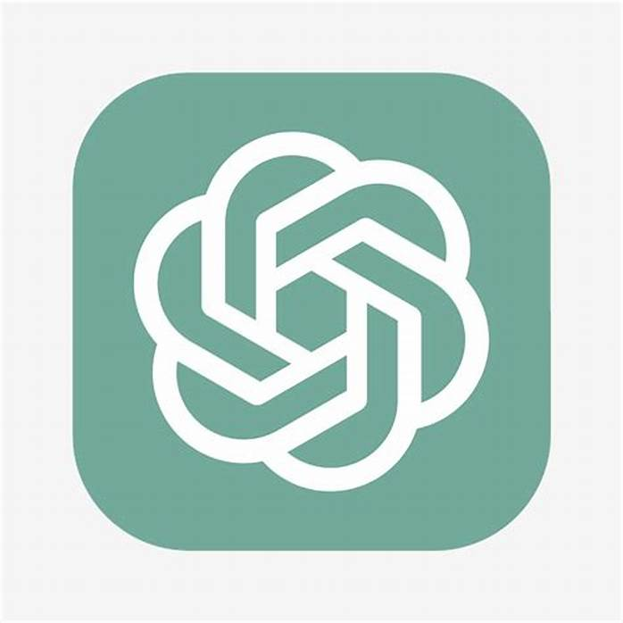<span>OpenAI</span></span>
  <span style="display:inline-flex;align-items:center;gap:8px;padding:6px 10px;border:1px solid #d0d7de;border-radius:999px;"><span>Azure OpenAI</span></span>
  <span style="display:inline-flex;align-items:center;gap:8px;padding:6px 10px;border:1px solid #d0d7de;border-radius:999px;">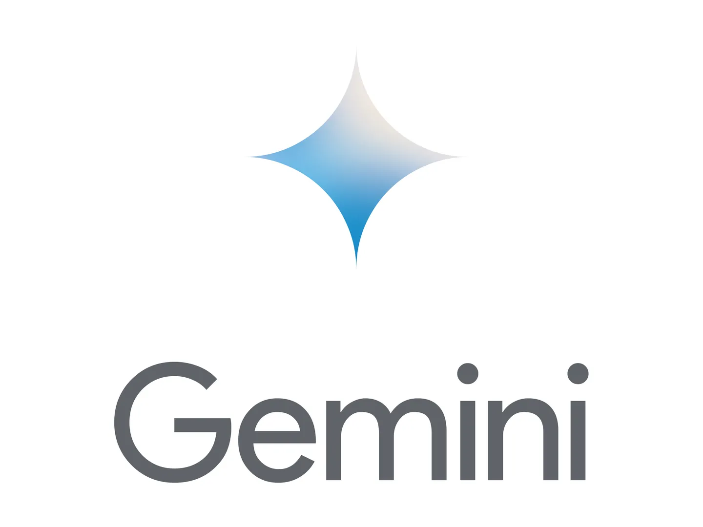<span>Gemini</span></span>
  <span style="display:inline-flex;align-items:center;gap:8px;padding:6px 10px;border:1px solid #d0d7de;border-radius:999px;">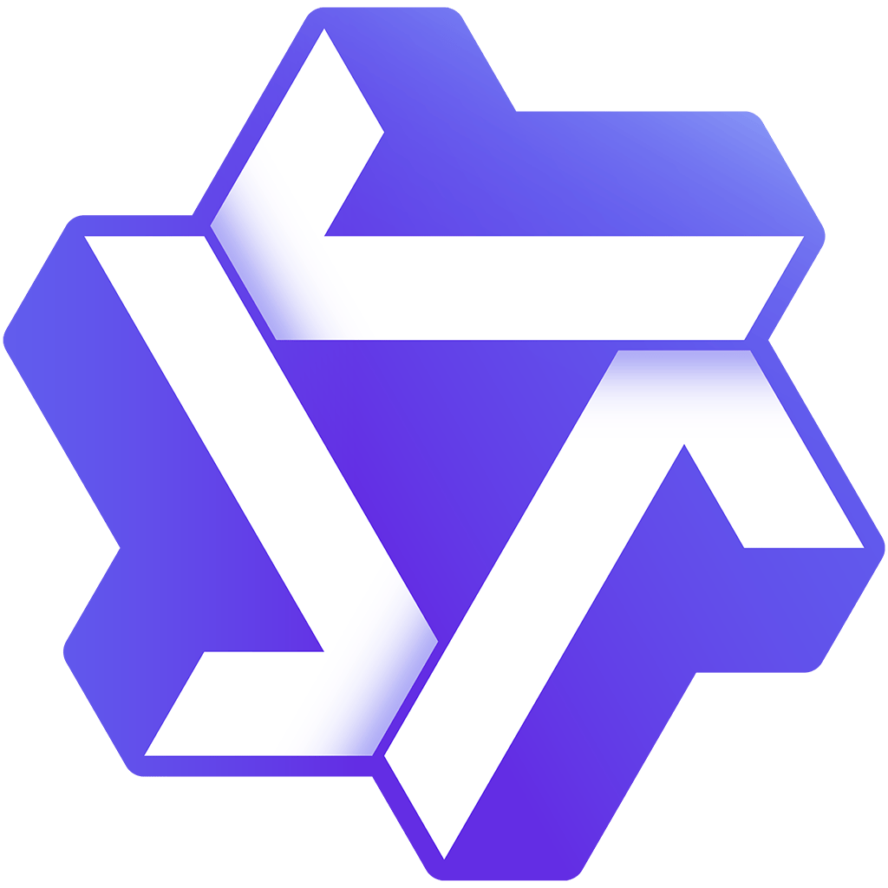<span>Qwen</span></span>
  <span style="display:inline-flex;align-items:center;gap:8px;padding:6px 10px;border:1px solid #d0d7de;border-radius:999px;"><span>ERNIE</span></span>
  <span style="display:inline-flex;align-items:center;gap:8px;padding:6px 10px;border:1px solid #d0d7de;border-radius:999px;"><span>ChatGLM</span></span>
  <span style="display:inline-flex;align-items:center;gap:8px;padding:6px 10px;border:1px solid #d0d7de;border-radius:999px;"><span>Moonshot / Kimi</span></span>
  <span style="display:inline-flex;align-items:center;gap:8px;padding:6px 10px;border:1px solid #d0d7de;border-radius:999px;">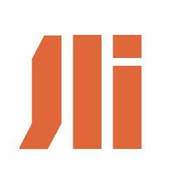<span>Baichuan</span></span>
  <span style="display:inline-flex;align-items:center;gap:8px;padding:6px 10px;border:1px solid #d0d7de;border-radius:999px;"><span>iFLYTEK Spark</span></span>
  <span style="display:inline-flex;align-items:center;gap:8px;padding:6px 10px;border:1px solid #d0d7de;border-radius:999px;">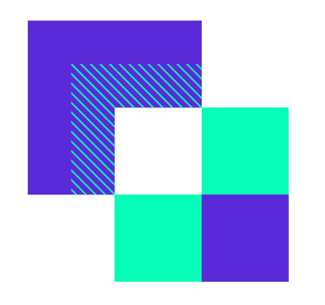<span>SenseChat</span></span>
  <span style="display:inline-flex;align-items:center;gap:8px;padding:6px 10px;border:1px solid #d0d7de;border-radius:999px;"><span>Doubao</span></span>
  <span style="display:inline-flex;align-items:center;gap:8px;padding:6px 10px;border:1px solid #d0d7de;border-radius:999px;">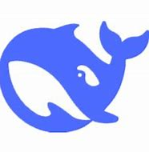<span>DeepSeek</span></span>
  <span style="display:inline-flex;align-items:center;gap:8px;padding:6px 10px;border:1px solid #d0d7de;border-radius:999px;">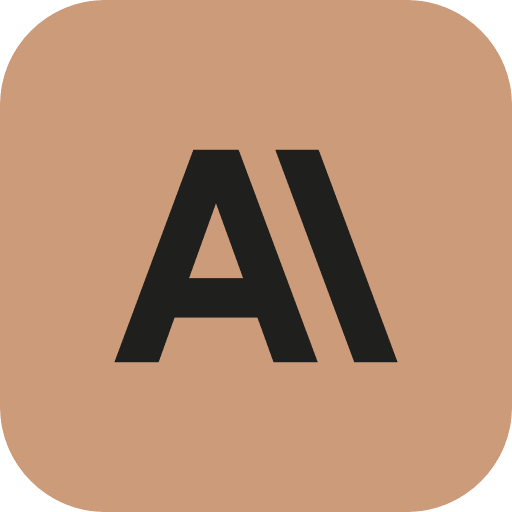<span>Claude</span></span>
  <span style="display:inline-flex;align-items:center;gap:8px;padding:6px 10px;border:1px solid #d0d7de;border-radius:999px;"><span>MiniMax</span></span>
  <span style="display:inline-flex;align-items:center;gap:8px;padding:6px 10px;border:1px solid #d0d7de;border-radius:999px;">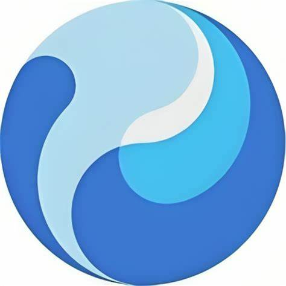<span>Hunyuan</span></span>
  <span style="display:inline-flex;align-items:center;gap:8px;padding:6px 10px;border:1px solid #d0d7de;border-radius:999px;"><span style="display:inline-flex;align-items:center;justify-content:center;width:18px;height:18px;border-radius:6px;background:#111827;color:#fff;font-size:10px;font-weight:700;">X</span><span>Grok</span></span>
  <span style="display:inline-flex;align-items:center;gap:8px;padding:6px 10px;border:1px solid #d0d7de;border-radius:999px;"><span style="display:inline-flex;align-items:center;justify-content:center;width:18px;height:18px;border-radius:6px;background:#0f766e;color:#fff;font-size:10px;font-weight:700;">OR</span><span>OpenRouter</span></span>
  <span style="display:inline-flex;align-items:center;gap:8px;padding:6px 10px;border:1px solid #d0d7de;border-radius:999px;"><span style="display:inline-flex;align-items:center;justify-content:center;width:18px;height:18px;border-radius:6px;background:#7c3aed;color:#fff;font-size:10px;font-weight:700;">SF</span><span>StepFun</span></span>
  <span style="display:inline-flex;align-items:center;gap:8px;padding:6px 10px;border:1px solid #d0d7de;border-radius:999px;"><span style="display:inline-flex;align-items:center;justify-content:center;width:18px;height:18px;border-radius:6px;background:#ea580c;color:#fff;font-size:10px;font-weight:700;">XM</span><span>Xiaomi</span></span>
  <span style="display:inline-flex;align-items:center;gap:8px;padding:6px 10px;border:1px solid #d0d7de;border-radius:999px;"><span style="display:inline-flex;align-items:center;justify-content:center;width:18px;height:18px;border-radius:6px;background:#334155;color:#fff;font-size:10px;font-weight:700;">OA</span><span>OpenAI-compatible</span></span>
</div>

<div style="display:flex;flex-wrap:wrap;gap:8px 10px;margin:0 0 20px;">
  <span style="display:inline-flex;align-items:center;gap:8px;padding:6px 10px;border:1px solid #d0d7de;border-radius:999px;"><span style="display:inline-flex;align-items:center;justify-content:center;width:18px;height:18px;border-radius:6px;background:#0f172a;color:#fff;font-size:10px;font-weight:700;">OC</span><span>OpenClaw</span></span>
  <span style="display:inline-flex;align-items:center;gap:8px;padding:6px 10px;border:1px solid #d0d7de;border-radius:999px;"><span style="display:inline-flex;align-items:center;justify-content:center;width:18px;height:18px;border-radius:6px;background:#6d28d9;color:#fff;font-size:10px;font-weight:700;">HA</span><span>Hermes Agent</span></span>
  <span style="display:inline-flex;align-items:center;gap:8px;padding:6px 10px;border:1px solid #d0d7de;border-radius:999px;"><span style="display:inline-flex;align-items:center;justify-content:center;width:18px;height:18px;border-radius:6px;background:#166534;color:#fff;font-size:10px;font-weight:700;">DF</span><span>DeerFlow</span></span>
  <span style="display:inline-flex;align-items:center;gap:8px;padding:6px 10px;border:1px solid #d0d7de;border-radius:999px;">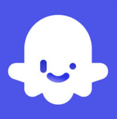<span>Coze</span></span>
  <span style="display:inline-flex;align-items:center;gap:8px;padding:6px 10px;border:1px solid #d0d7de;border-radius:999px;"><span>文心智能体</span></span>
  <span style="display:inline-flex;align-items:center;gap:8px;padding:6px 10px;border:1px solid #d0d7de;border-radius:999px;"><span>智谱智能体</span></span>
  <span style="display:inline-flex;align-items:center;gap:8px;padding:6px 10px;border:1px solid #d0d7de;border-radius:999px;"><span>混元智能体</span></span>
</div>

<div style="display:flex;flex-wrap:wrap;gap:8px 10px;margin:0 0 20px;">
  <span style="display:inline-flex;align-items:center;gap:8px;padding:6px 10px;border:1px solid #d0d7de;border-radius:999px;">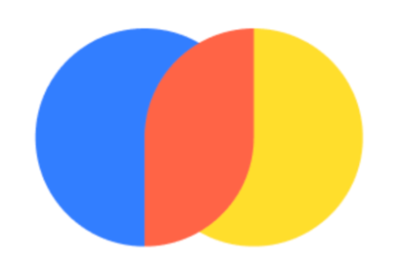<span>Chroma</span></span>
  <span style="display:inline-flex;align-items:center;gap:8px;padding:6px 10px;border:1px solid #d0d7de;border-radius:999px;"><span>Elasticsearch</span></span>
  <span style="display:inline-flex;align-items:center;gap:8px;padding:6px 10px;border:1px solid #d0d7de;border-radius:999px;"><span>MySQL</span></span>
</div>

## 为什么选 LinkMind

- 一层中间件同时覆盖聊天、OCR、ASR/TTS、图片生成、图像与视频理解、Text-to-SQL、Embedding、Rerank、文档处理等能力。
- 多模型路由与故障切换统一配置在 `lagi.yml`，业务侧不用为不同厂商重复改接口。
- RAG 直接围绕向量库、文档处理和知识库更新构建，方便做企业私有知识问答。
- Medusa 缓存、Token 统计、过滤器和运行时治理，都是面向真实生产环境的成本与稳定性问题设计的。
- OpenClaw、Hermes Agent、DeerFlow 的配置同步能力已经在当前代码里就位，适合逐步接入现有 Agent 工作流。

## 几分钟上手

### 1. 官方安装脚本

前置要求：安装 **JDK 8 或以上版本**。

- Windows PowerShell

  ```powershell
  iwr -useb https://downloads.landingbj.com/install.ps1 | iex
  ```

- macOS / Linux

  ```bash
  curl -fsSL https://downloads.landingbj.com/install.sh | bash
  ```

安装器支持两种运行模式：

| 模式 | 适用场景 |
| --- | --- |
| `Agent Mate` | 本机已经在使用 OpenClaw、Hermes Agent、DeerFlow，希望 LinkMind 作为统一中间层接入 |
| `Agent Server` | 先单独启动 LinkMind，直接体验控制台和 API，或做独立部署评估 |

### 2. 直接运行 JAR

```powershell
java -jar LinkMind.jar
```

首次启动会自动生成 `config/`、`data/` 和默认的 `lagi.yml`，随后访问 `http://localhost:8080` 即可。

### 3. 从源码构建

```bash
mvn clean package -pl lagi-web -am -DskipTests -U
```

当前打包结果为：

- `lagi-web/target/LinkMind.jar`
- `lagi-web/target/ROOT.war`

更完整的安装说明见 [安装指南](docs/install_zh.md)。

## 文档导航

| 目标 | English | 中文 |
| --- | --- | --- |
| 快速启动检查单 | [QuickStart](QuickStart.md) | [QuickStart](QuickStart.md) |
| 安装与运行 | [Installation Guide](docs/install_en.md) | [安装指南](docs/install_zh.md) |
| 配置模型、路由、RAG、Skills 与过滤器 | [Configuration Reference](docs/config_en.md) | [配置参考](docs/config_zh.md) |
| 调用原生接口与 OpenAI 兼容接口 | [API Reference](docs/API_en.md) | [API 参考](docs/API_zh.md) |
| 将 `lagi-core` 或 REST API 集成进业务系统 | [Integration Guide](docs/guide_en.md) | [开发集成指南](docs/guide_zh.md) |
| 跟着示例完成首轮体验 | [Tutorial](docs/tutor_en.md) | [教学演示](docs/tutor_zh.md) |
| 扩展模型、向量库和适配器 | [Extension Guide](docs/extend_en.md) | [扩展开发文档](docs/extend_zh.md) |
| Chroma 安装和补充说明 | [Annex](docs/annex_en.md) | [附件](docs/annex_zh.md) |

## 接口风格

LinkMind 当前同时暴露两套路由风格：

- 已支持无额外版本前缀的 LinkMind 原生路由，例如 `/chat/completions`、`/audio/speech2text`、`/audio/text2speech`、`/image/text2image`、`/sql/text2sql`、`/instruction/generate`、`/doc/doc2ext`、`/ocr/doc2ocr`
- 需要保留标准前缀的 OpenAI 兼容路由，例如 `/v1/chat/completions`、`/v1/models`、`/v1/embeddings`、`/v1/images/generations`、`/v1/rerank`

当前有一个仍按代码映射保留在 `/v1` 命名空间下的例外：向量管理接口 `/v1/vector/*`。

## Agent 运行时集成

- **OpenClaw**：可以把 LinkMind 注入为 OpenAI 兼容 Provider，也可以把 OpenClaw 的模型选择反向同步回 `lagi.yml`
- **Hermes Agent**：可以通过 `~/.hermes/config.yaml` 和 `.env` 导入导出模型配置
- **DeerFlow**：可以通过 DeerFlow 的 `config.yaml` 和 `.env` 导入导出模型配置

如果你只是首次评估，建议先用 `Agent Server` 跑通控制台与 API；确认稳定后，再切到 `Agent Mate` 接入现有 Agent 运行时。

## 核心能力

- 基于 `best(...)` 与 `pass(...)` 的统一聊天路由
- OpenAI 兼容聊天与 Embedding 接口
- 面向知识库的 RAG、文档抽取、OCR 和向量更新
- ASR、TTS、文生图、图像 OCR、看图、图生视频、视频追踪、视频增强等多模态能力
- Text-to-SQL、SQL-to-Text、指令集生成、MCP 接入与 Worker 编排
- 敏感词、优先级词、停止词、续聊词等过滤器
- Skills 运行时、MCP 服务配置与 Token 使用观测

## 构建与打包说明

- 根工程版本：`1.2.3`
- 模块：`lagi-web`、`lagi-core`、`lagi-extension`
- 默认运行入口：`ai.starter.Application`

## License

本项目遵循 [LICENSE](LICENSE)。
