# Tutorial

This walkthrough is meant to get you from zero to a usable LinkMind environment without throwing away features that still exist in the product. Read the **Essential** part first, then continue with **Advanced** when you are ready to go deeper.

## Part 1. Essential

### 1.1 Start LinkMind

Use any one of the four options from the [Installation Guide](install_en.md):

- Official Installer
- Download Packaged Jar
- With Docker Image
- Build from Source

When the server is ready, open:

- `http://localhost:8080`

### 1.2 Create Your First Usable Configuration

Before testing anything, make sure at least one real model key is configured.

The shortest practical path is:

1. Sign in to the web console.
2. Open the model or API-key settings page.
3. Fill in one provider key.
4. Enable one chat backend in `lagi.yml`.

A minimal chat example looks like this:

```yaml
models:
  - name: qwen
    type: Alibaba
    enable: true
    model: qwen-plus,qwen-max
    driver: ai.wrapper.impl.AlibabaAdapter
    api_key: your-api-key
    # For multiple keys, use a key pool instead:
    # api_keys: sk-key1,sk-key2,sk-key3
    # key_route: polling  # polling (round-robin) or failover

functions:
  chat:
    route: pass(qwen)
    backends:
      - backend: qwen
        model: qwen-plus
        enable: true
        stream: true
        priority: 100

routers:
  enable: true
  items:
    - name: pass
      rule: (%)
```

### 1.3 Verify Chat In The Console

Return to the chat page and send a simple prompt such as:

- `Introduce LinkMind in one paragraph.`

If you get a normal answer, your first provider configuration is working.

### 1.4 Verify The HTTP API

#### Native LinkMind Route

```bash
curl http://localhost:8080/chat/completions \
  -H "Content-Type: application/json" \
  -d '{
    "model": "qwen-plus",
    "stream": false,
    "messages": [
      {"role": "user", "content": "List three core LinkMind capabilities."}
    ]
  }'
```

#### OpenAI-Compatible Route

```bash
curl http://localhost:8080/v1/chat/completions \
  -H "Content-Type: application/json" \
  -d '{
    "model": "qwen-plus",
    "stream": false,
    "messages": [
      {"role": "user", "content": "List three core LinkMind capabilities."}
    ]
  }'
```

If auth is enabled, add:

```http
Authorization: Bearer <your-linkmind-api-key>
```

### 1.5 Enable RAG

If you want answers grounded in your own data:

1. Start Chroma.
2. Point `stores.vector[*].url` at Chroma.
3. Enable `stores.rag`.
4. Configure an embedding backend.
5. Ingest data through the console or vector APIs.

Chroma quick start:

```bash
pip install chromadb
mkdir db_data
chroma run --path db_data
```

Then set:

```yaml
stores:
  vector:
    - name: chroma
      driver: ai.vector.impl.ChromaVectorStore
      url: http://localhost:8000

  rag:
    vector: chroma
    enable: true
```

### 1.6 Try The Multimodal Endpoints

The current server still exposes these common workflows:

- `POST /audio/speech2text`
- `GET /audio/text2speech`
- `POST /image/text2image`
- `POST /image/image2ocr`
- `POST /image/image2text`
- `POST /image/image2enhance`
- `POST /image/image2video`
- `POST /video/video2tracking`
- `POST /video/video2enhance`
- `POST /ocr/doc2ocr`
- `POST /doc/doc2ext`
- `POST /doc/doc2struct`
- `POST /sql/text2sql`

Use the [API Reference](API_en.md) for request examples.

### 1.7 Optional: Connect An Agent Runtime

If your local workflow already uses OpenClaw, Hermes Agent, DeerFlow, or OpenHuman:

1. Reinstall or restart LinkMind in `Agent Mate` mode.
2. Verify that the runtime config path is correct.
3. Let LinkMind act as the shared middleware layer instead of wiring every business app directly to each provider.

### 1.8 Next Steps

- Tune models, routes, filters, and RAG: [Configuration Reference](config_en.md)
- Integrate with your own service: [Integration Guide](guide_en.md)
- Extend models or vector stores: [Extension Guide](extend_en.md)

## Part 2. Advanced

### 2.1 Build From Source, IDE, Or WAR Deployment

If you need a more traditional developer workflow, these options are still valid.

#### Maven Packaging

```bash
git clone https://github.com/landingbj/lagi.git
cd lagi
mvn clean package -pl lagi-web -am -DskipTests -U
```

Build outputs:

- `lagi-web/target/LinkMind.jar`
- `lagi-web/target/ROOT.war`

#### IDE Workflow

You can still import the project into IntelliJ IDEA or Eclipse, build locally, and run with your own debug configuration.

#### WAR / Tomcat Deployment

If your team still prefers a servlet container:

1. Build `ROOT.war`.
2. Drop it into Tomcat `webapps`.
3. Keep `lagi.yml` aligned with the same models and stores you would use in the standalone JAR.

### 2.2 Switch Models And Adjust Routes

LinkMind is not limited to one chat backend. You can keep multiple providers enabled and decide how they are used.

Example:

```yaml
functions:
  chat:
    route: best((landing&qwen),(kimi|chatgpt))
    backends:
      - backend: landing
        model: cascade
        enable: true
        stream: true
        priority: 350

      - backend: qwen
        model: qwen-plus
        enable: true
        stream: true
        priority: 100

      - backend: kimi
        model: moonshot-v1-8k
        enable: true
        stream: true
        priority: 90
```

Useful route ideas:

- `A|B`: polling
- `A,B`: failover
- `A&B`: parallel

### 2.3 Private Training With QA Pairs

Private training QA is still part of the product workflow and should not be omitted when your use case depends on structured knowledge.

Recommended flow:

1. Prepare domain FAQs or manually curated question-answer pairs.
2. Use LinkMind to normalize them into clear, reusable QA items.
3. Write them into your knowledge category and let RAG retrieve them during chat.

#### Private Training Architecture

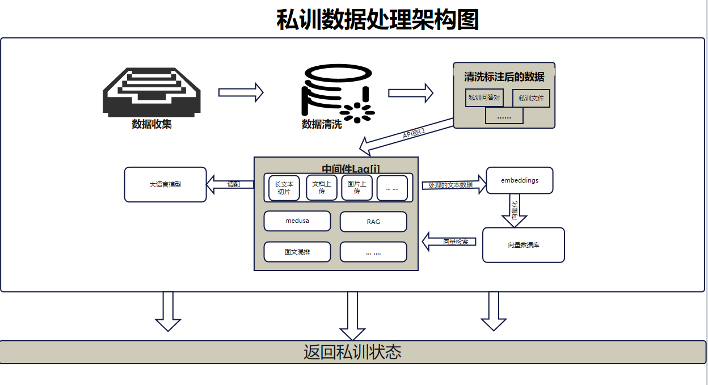

#### Private Training Workflow

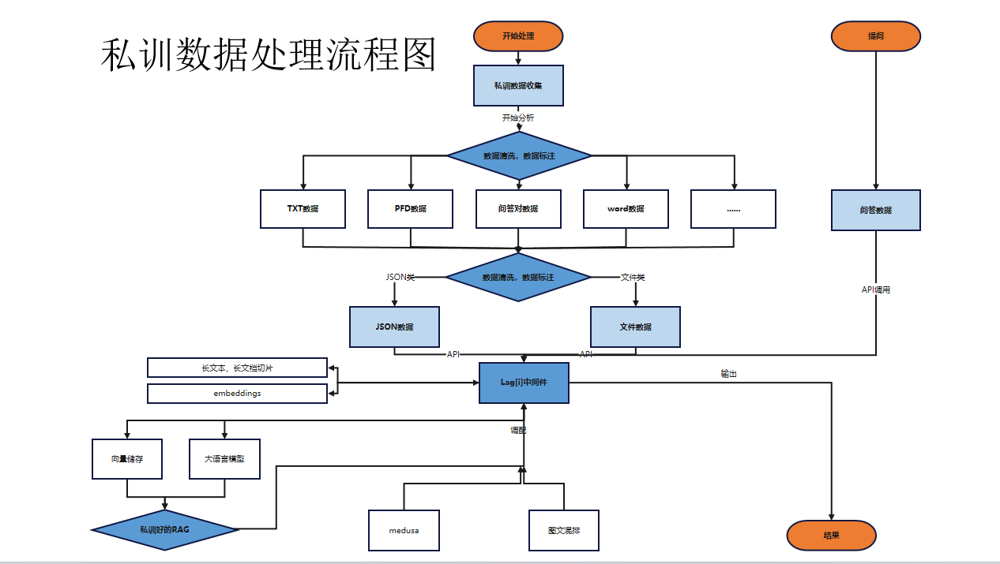

#### Practical Advice

- Keep one topic per QA pair.
- Write questions the same way real users ask them.
- Keep answers direct and short before adding long explanations.
- Separate different business domains into different categories when possible.

### 2.4 Generate Instruction Sets

Use instruction generation when you want to turn documents into training-oriented prompts or QA material.

Typical extraction criteria:

1. Extract questions and answers from the source document with clear structure.
2. Summarize key facts into concise and accurate responses.
3. Preserve enough context for later training or retrieval.
4. Segment by topic instead of dumping the entire source as one block.

Use the [API Reference](API_en.md) for instruction-generation request details.

### 2.5 Upload Private Training Files

Uploading private training files is still part of the product path for building internal knowledge.

You can upload through the console or through the file-ingestion routes such as `/uploadFile/*`, `/training/*`, and the document/vector APIs, depending on your workflow.

#### Supported File Formats

- Text: `txt`, `doc`, `docx`, `pdf`
- Spreadsheets: `xls`, `xlsx`, `csv`
- Images: `jpeg`, `png`, `jpg`, `webp`
- Presentations: `ppt`, `pptx`

#### File Processing Strategies

Different file categories are still handled differently:

1. QA files: extract and separate question-answer pairs.
2. Chapter-based documents: preserve paragraph completeness after structure cleanup.
3. Tables and spreadsheets: convert headers and rows into model-friendly text or structured content.
4. Numeric tables: optionally cooperate with text-to-SQL and relational storage.
5. Image-text mixed files: combine OCR and layout extraction.
6. Title-heavy files: keep titles as standalone knowledge anchors.
7. Presentation files: process page-by-page text and images together.
8. Pure image files: use OCR or image understanding to turn them into retrievable content.

## Part 3. Agent Client Hands-On Setup (Agent Mate)

This section shows how to connect LinkMind to OpenClaw, Hermes Agent, DeerFlow, and OpenHuman, then verify the full loop from client-side conversation to LinkMind usage records.

### 3.1 Integration Path Overview

The overall flow is the same for all four clients: prepare the client runtime, install LinkMind in `Agent Mate` mode, configure LinkMind credits, API keys, and routes, then point the client model request path to LinkMind.

| Client | Entry / URL | LinkMind install choice | Core configuration | Verification |
| --- | --- | --- | --- | --- |
| OpenClaw | Web UI: `127.0.0.1:18789` | `Agent Mate`, framework `openclaw` | `lagi.yml`; select LinkMind middleware in the OpenClaw UI | Switch to `linkmind-Pro` and chat in OpenClaw |
| Hermes Agent | PowerShell/WSL terminal: `hermes` | `Agent Mate`, framework `hermes` | `lagi.yml`, Hermes `config.yaml` | Type a message directly in the Hermes console |
| DeerFlow | Frontend: `localhost:3000` or the URL printed by `make dev` | `Agent Mate`, framework `deer-flow`, with the project absolute path | `lagi.yml`, DeerFlow `config.yaml`, `.env` | Select the LinkMind model in the DeerFlow Chat page and send a message |
| OpenHuman | Desktop app | `Agent Mate`, framework `openhuman`, optional config path | `lagi.yml`, OpenHuman `config.toml` | Send a message in OpenHuman and confirm a LinkMind `/v1/chat/completions` call |

### 3.2 Prepare The Agent Clients

#### OpenClaw Preparation

Check Node.js, Git, and the PowerShell script execution policy first:

```powershell
node -v
git -v
Set-ExecutionPolicy -ExecutionPolicy RemoteSigned -Scope CurrentUser
```

If OpenClaw is not installed yet, run the official installer in PowerShell, choose QuickStart, fill in the provider API key, and skip IM platforms or Skills if you do not need them. If OpenClaw is already installed, verify the version and start the Gateway:

```powershell
iwr -useb https://openclaw.ai/install.ps1 | iex

openclaw --version
openclaw gateway start
```

After startup, open `127.0.0.1:18789`.

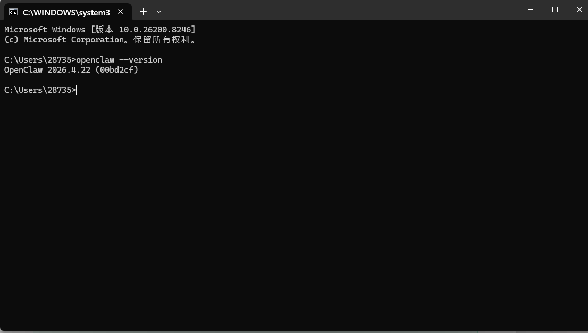

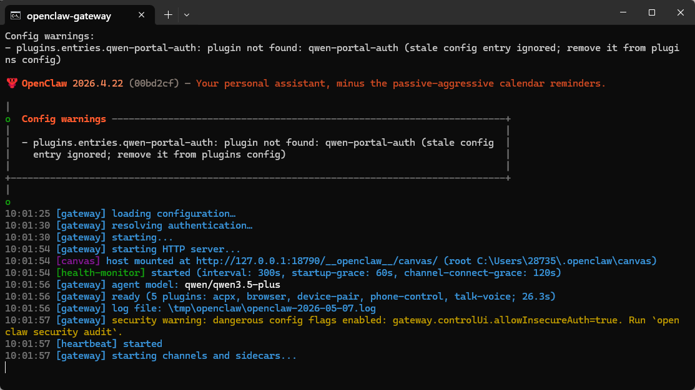

#### Hermes Agent Preparation

Confirm that the `hermes` command is available and check its version and status:

```powershell
where.exe hermes
hermes --version
hermes status
```

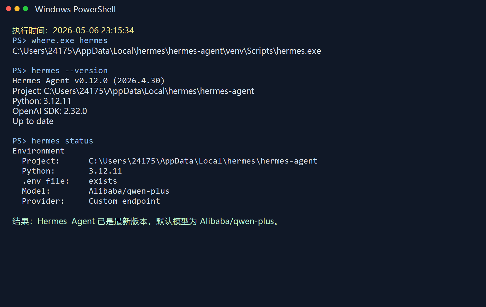

If Hermes runs in WSL or a virtual environment while LinkMind runs on the Windows host, set `base_url` to an address reachable from WSL, such as `http://192.168.190.1:8080/v1`. If WSL cannot reach LinkMind, make LinkMind listen on `0.0.0.0:8080` and check Windows Firewall rules. Only do this on a trusted local network.

#### DeerFlow Preparation

DeerFlow has more local dependencies: Python 3.12 or later, Node.js 22 or later, plus `pnpm`, `uv`, and `nginx`. Use an absolute path without Chinese characters or spaces when possible.

| Check | Command / Requirement |
| --- | --- |
| Python | `python --version`; requires 3.12 or later |
| Node.js | `node -v`; requires 22 or later |
| uv | `pip install uv`, then `uv --version` |
| Project configuration | `git clone https://github.com/bytedance/deer-flow.git`, then `make config` or `python scripts/configure.py` |
| Dependencies | `make install`; on Windows without `make`, run `uv sync` in backend and `pnpm install` in frontend |

Common startup flow:

```bash
git clone https://github.com/bytedance/deer-flow.git
cd deer-flow
pip install uv
make config
make check
make install
make dev
```

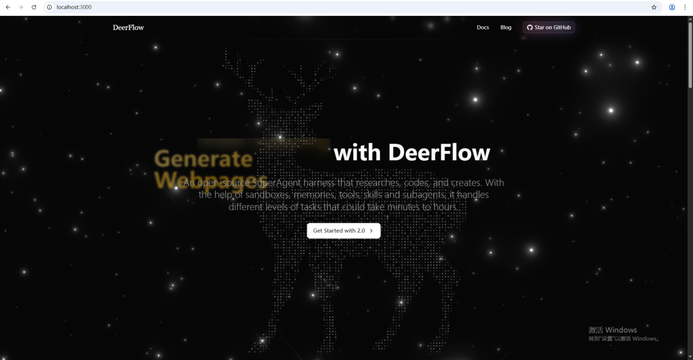

#### OpenHuman Preparation

Install OpenHuman from the official desktop release for `tinyhumansai/openhuman`; on Windows, use the official MSI. Launch it once and confirm that its workspace exists. LinkMind auto-detects the active OpenHuman config in this order:

1. `--openhuman-path=` when provided by the installer or JAR command.
2. `OPENHUMAN_WORKSPACE`, including workspace-style paths.
3. `~/.openhuman/active_user.toml` to `~/.openhuman/users/<user_id>/config.toml`.
4. `~/.openhuman/users/local/config.toml` before login.

OpenHuman uses provider routing through `[[cloud_providers]]` and workload fields such as `chat_provider`, so no OpenHuman-specific LinkMind servlet is required.

### 3.3 Install LinkMind And Choose The Target Framework

This step is shared by all four clients. First confirm that JDK 8 or later is available, then run the LinkMind quick installer:

```bash
java -version
```

Windows PowerShell:

```powershell
iwr -useb https://cdn.linkmind.top/install.ps1 | iex
```

macOS / Linux:

```bash
curl -fsSL https://cdn.linkmind.top/install.sh | bash
```

Choose `Agent Mate` as the runtime mode. The only difference between clients is the `Inject Agent Framework` choice:

| Current client | Runtime Choice | Inject Agent Framework | Extra input |
| --- | --- | --- | --- |
| OpenClaw | `1) as Agent Mate` | `1) openclaw` | None |
| DeerFlow | `1) as Agent Mate` | `2) deer-flow` | DeerFlow project absolute path, for example `D:\workspace\code\deer-flow` |
| Hermes Agent | `1) as Agent Mate` | `3) hermes` | None; if using WSL, verify the `base_url` later |
| OpenHuman | `1) as Agent Mate` | `4) openhuman` | Optional OpenHuman config directory or `config.toml`; leave blank for auto-detect |

After installation, you can start LinkMind immediately. If you choose not to start it from the installer, enter the LinkMind directory later and run:

```powershell
cd "$env:USERPROFILE\LinkMind"
java -jar LinkMind.jar --enable-sync=false

# Or start it in a separate PowerShell process
Start-Process java -ArgumentList "-jar LinkMind.jar --enable-sync=false"
Get-NetTCPConnection -LocalPort 8080 -State Listen
```

When the service is ready, open `http://localhost:8080`.

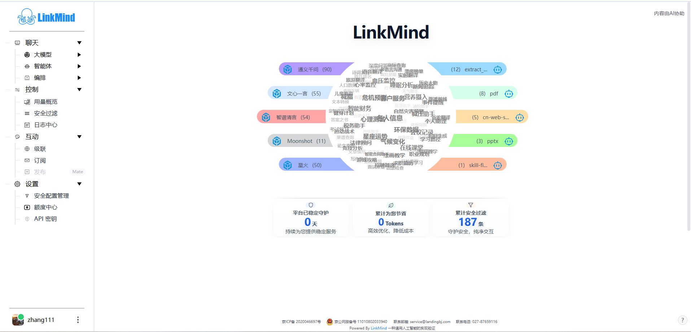

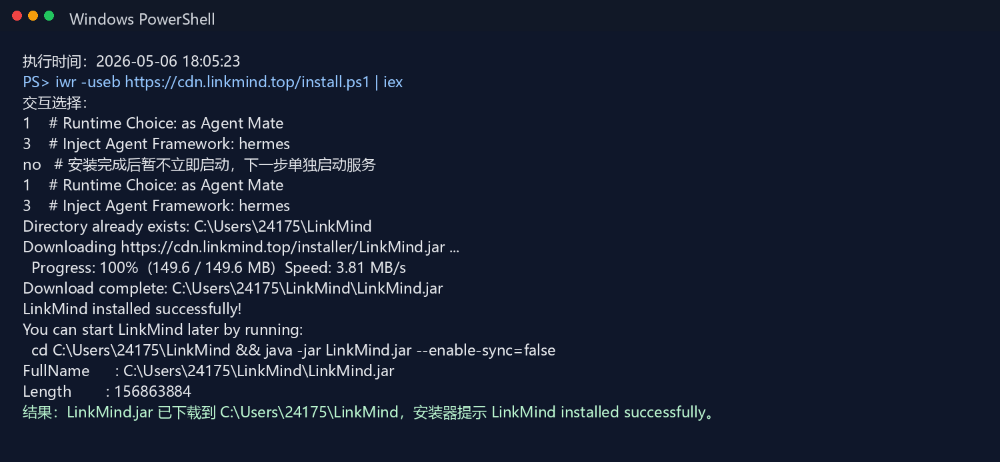

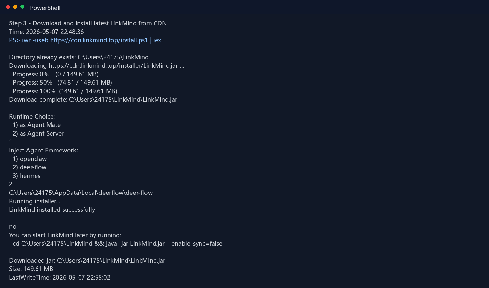

### 3.4 Configure Credits, API Keys, And Routing

All four clients send model calls through LinkMind. First confirm that the LinkMind account has available credits, then create and enable a Landing provider API key under Settings / API Keys. If you maintain the configuration manually, confirm that `chat.route` points to the `landing` backend.

Recommended checks:

1. Open `http://localhost:8080`, go to Settings / Credits, and confirm that the account has available balance.
2. Open Settings / API Keys, create a new provider configuration, choose Landing, and give it a recognizable name.
3. Enable the new API key in the API-key list and copy it for client-side configuration if needed.
4. Check `config/lagi.yml` and confirm that the `landing` backend is enabled and `chat.route` points to it.

Example:

```yaml
functions:
  chat:
    route: "best(landing)"
    backends:
      - backend: "landing"
        enable: true
        model: "Alibaba/qwen-plus"
        api_key: "sk-******"
        stream: true
```

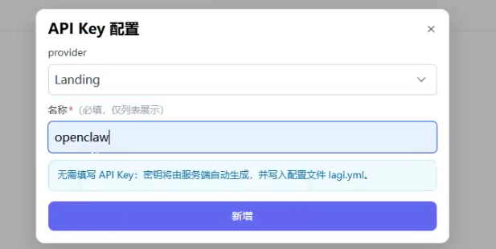

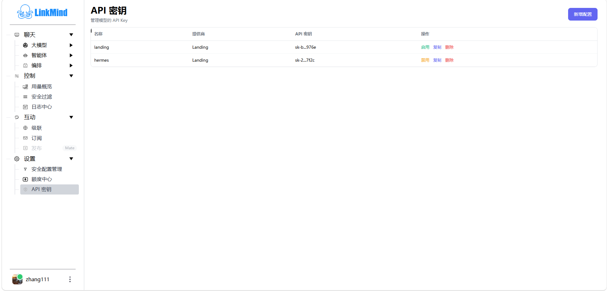

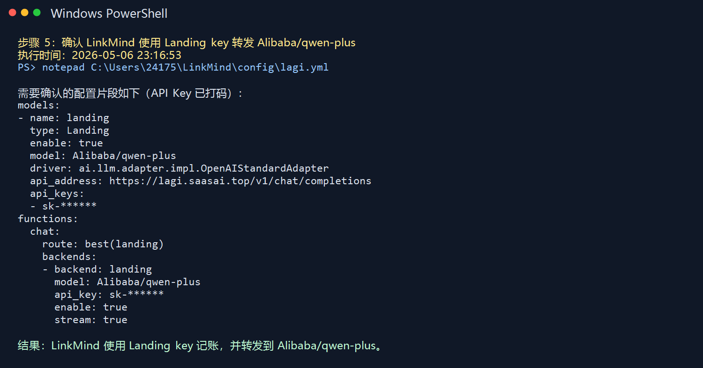

### 3.5 Connect Each Client To LinkMind

#### OpenClaw Client

1. Open the OpenClaw Web UI at `127.0.0.1:18789`.
2. In the OpenClaw console, select LinkMind as the middleware.
3. Return to the chat page and switch the chat model to `linkmind-Pro` or the LinkMind model synchronized by the installer.
4. Send a test message and confirm that OpenClaw returns a normal response.

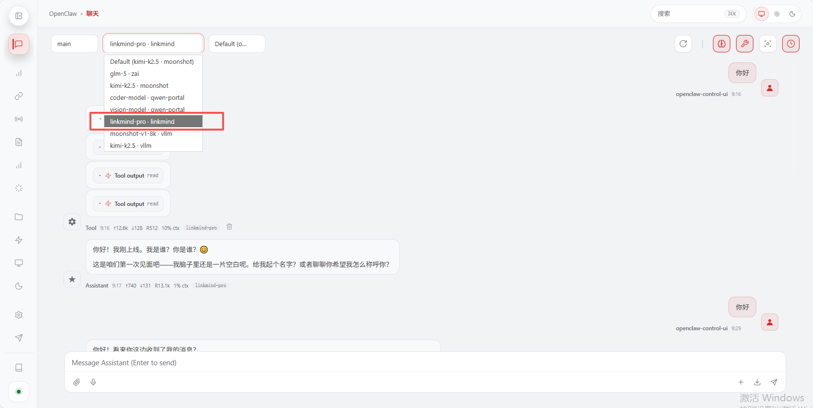

#### Hermes Agent Client

Hermes points to LinkMind through a custom provider in `config.yaml`. When Hermes runs on the Windows host, use `http://localhost:8080/v1`. When Hermes runs inside WSL, use the Windows host IP instead.

```yaml
model:
  default: Alibaba/qwen-plus
  provider: custom
  base_url: http://localhost:8080/v1
  api_key: sk-******
  api_mode: chat_completions
  context_length: 64000
```

After saving the file, press `Ctrl+C` to exit the current Hermes session, then run:

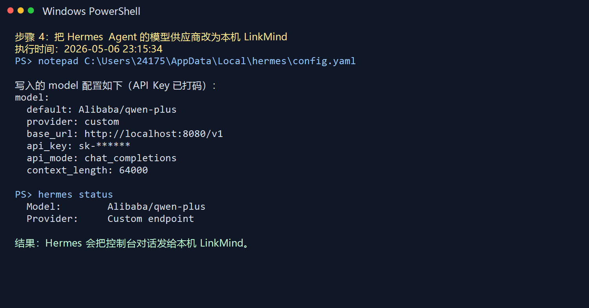

```powershell
hermes
```

Type a test message directly in the Hermes console. If a response appears, Hermes has completed a real model call through LinkMind.

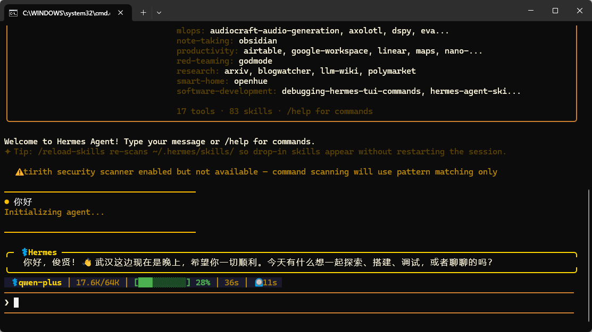

#### DeerFlow Client

DeerFlow can point its model provider to LinkMind through configuration, and in some setups you can also choose LinkMind middleware from the UI. In the example flow, Gateway listens on `8001`, the frontend listens on `3000`, and the new-chat page is `/workspace/chats/new`.

`config.yaml` example:

```yaml
models:
  - name: "linkmind-qwen-plus"
    display_name: "LinkMind Qwen Plus"
    use: "deerflow.models.linkmind_provider:LinkMindChatModel"
    model: "Alibaba/qwen-plus"
    api_key: "$LINKMIND_API_KEY"
    base_url: "http://localhost:8080/v1"
    request_timeout: 600.0
    max_retries: 2
    max_tokens: 4096
    temperature: 0.7
    supports_vision: false
    supports_thinking: false
    disable_streaming: true
```

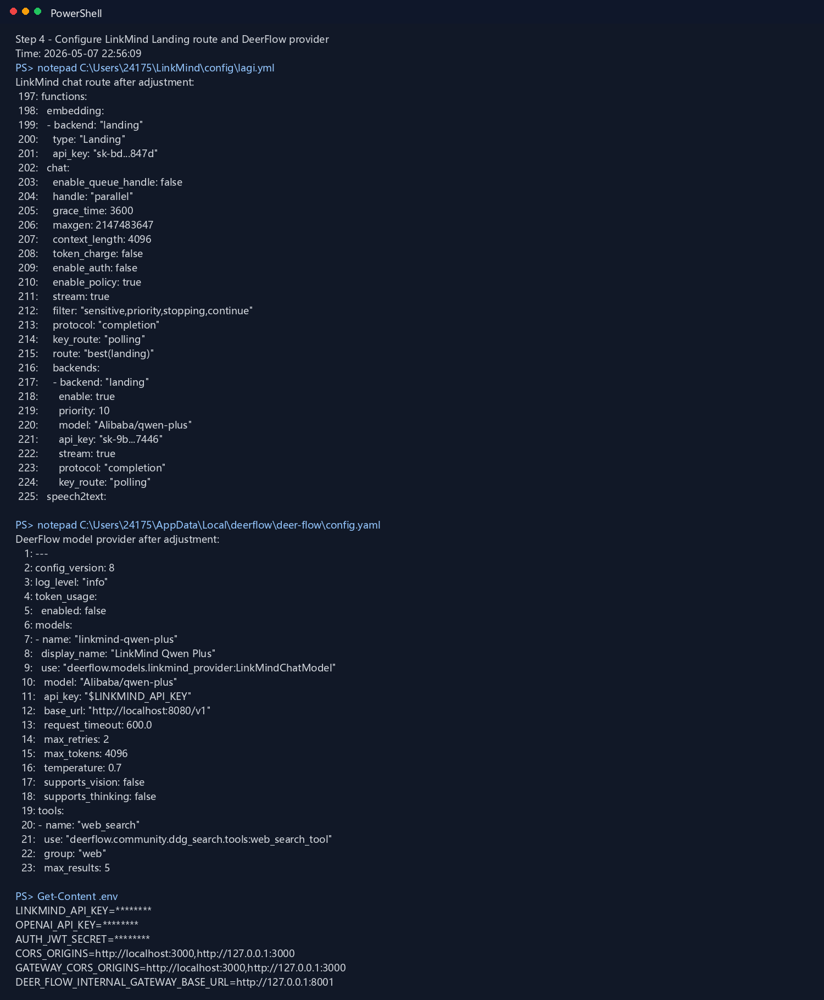

`.env` example:

```env
LINKMIND_API_KEY=********
CORS_ORIGINS=http://localhost:3000,http://127.0.0.1:3000
GATEWAY_CORS_ORIGINS=http://localhost:3000,http://127.0.0.1:3000
DEER_FLOW_INTERNAL_GATEWAY_BASE_URL=http://127.0.0.1:8001
```

Start DeerFlow Gateway and frontend:

```powershell
cd D:\workspace\deer-flow\backend
$env:PYTHONPATH = "."
uv run uvicorn app.gateway.app:app --host 0.0.0.0 --port 8001

cd D:\workspace\deer-flow\frontend
corepack pnpm run dev
```

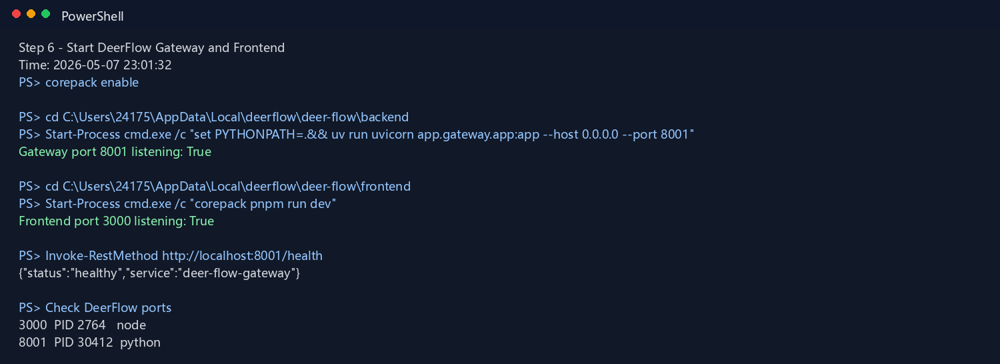

Open:

- `http://localhost:3000/workspace/chats/new`

Select `LinkMind Qwen Plus`, send a test message, and confirm that the page returns a response.

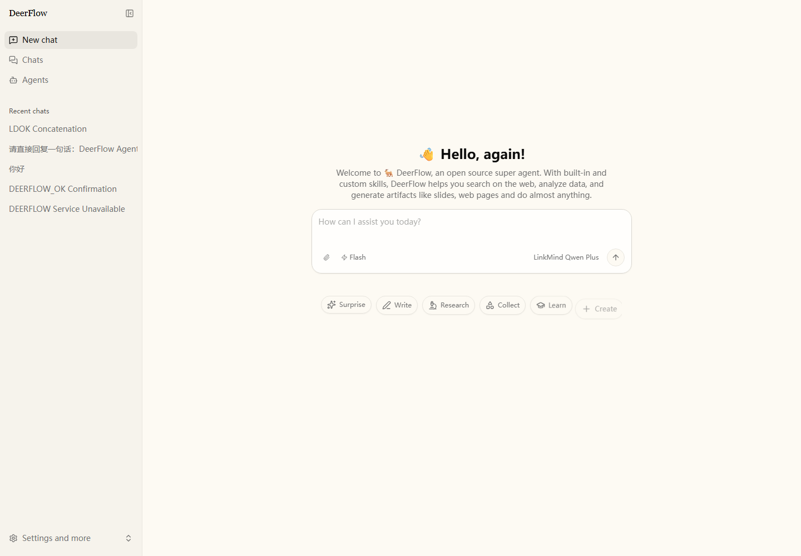

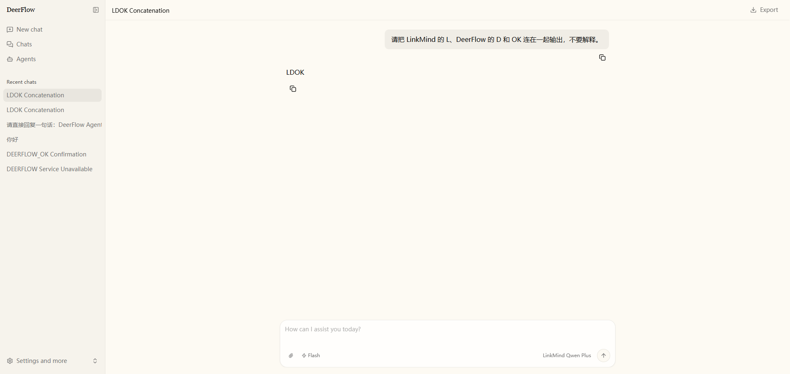

#### OpenHuman Client

The OpenHuman installer branch writes a `linkmind` provider to OpenHuman `config.toml`:

```toml
chat_provider = "linkmind:Alibaba/qwen3.6-plus"
reasoning_provider = "linkmind:Alibaba/qwen3.6-plus"
agentic_provider = "linkmind:Alibaba/qwen3.6-plus"
coding_provider = "linkmind:Alibaba/qwen3.6-plus"
memory_provider = "linkmind:Alibaba/qwen3.6-plus"
heartbeat_provider = "linkmind:Alibaba/qwen3.6-plus"
learning_provider = "linkmind:Alibaba/qwen3.6-plus"
subconscious_provider = "linkmind:Alibaba/qwen3.6-plus"

[[cloud_providers]]
id = "p_linkmind_linkmind"
slug = "linkmind"
label = "LinkMind"
endpoint = "http://127.0.0.1:8080/v1"
auth_style = "bearer"
default_model = "Alibaba/qwen3.6-plus"
```

Set `LINKMIND_API_KEY` before running the installer or starting LinkMind so `provider:linkmind` is activated in OpenHuman `auth-profiles.json` and the same token is written to OpenHuman's desktop keychain file when that file is present.

After LinkMind is running, restart OpenHuman if it was already open, send a message in OpenHuman, and confirm that LinkMind receives a `/v1/chat/completions` request.

### 3.6 Verify Conversation And Usage Records

After a client completes one conversation, return to the LinkMind console. The verification method is the same for all clients: check the client response, LinkMind call logs, usage overview, and credit balance.

| Check | OpenClaw | Hermes Agent | DeerFlow | OpenHuman |
| --- | --- | --- | --- | --- |
| Client side | OpenClaw chat page returns a model response | Hermes console no longer stays at Initializing agent and returns a response | DeerFlow Chat page shows the assistant response | OpenHuman chat returns a model response |
| LinkMind call logs | A call from OpenClaw / `linkmind-Pro` appears | Token records appear for the Hermes conversation | A new DeerFlow conversation record appears | A `/v1/chat/completions` call from OpenHuman appears |
| Credits | Balance or transaction records update | Balance decreases from the pre-chat baseline | Balance and Records / Total Tokens both update | Balance or usage records update |

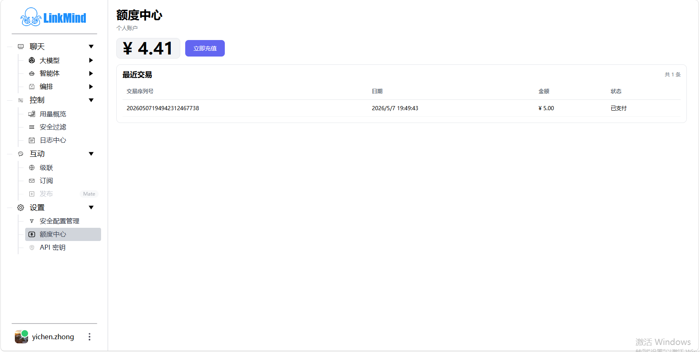

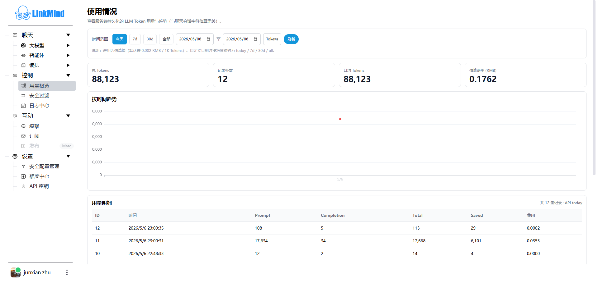

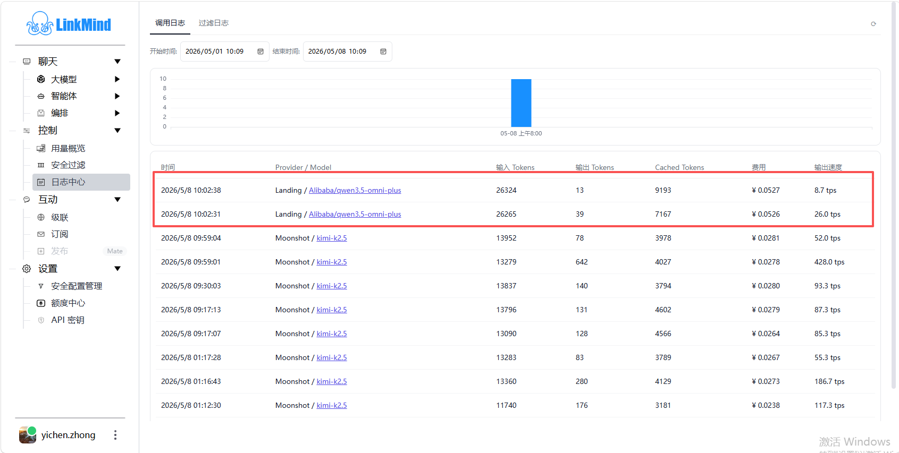

Completion criteria:

- LinkMind is reachable and `http://localhost:8080` opens the console.
- The current client points model requests to `http://localhost:8080/v1` or a reachable Windows host address.
- The client page or console returns a model response.
- At least one of LinkMind call logs, usage overview, or credit center updates for the request.

### 3.7 Repeatable Startup Commands

After the first installation and configuration, start LinkMind first, then start the agent client.

#### Common: Start LinkMind

```powershell
cd "$env:USERPROFILE\LinkMind"
java -jar "LinkMind.jar" --host=0.0.0.0 --port=8080 --enable-sync=false
```

#### OpenClaw

```powershell
openclaw gateway start
# Open 127.0.0.1:18789 in the browser
```

#### Hermes Agent

```powershell
hermes status
hermes
```

#### DeerFlow

```powershell
cd D:\workspace\deer-flow\backend
$env:PYTHONPATH = "."
uv run uvicorn app.gateway.app:app --host 0.0.0.0 --port 8001

cd D:\workspace\deer-flow\frontend
corepack pnpm run dev
```

#### OpenHuman

Start LinkMind first, then open the OpenHuman desktop app. If OpenHuman was running while the installer changed `config.toml`, restart it so the new `linkmind` provider is loaded.

## Part 4. AI Agents Project Best Practice Reading Materials

After completing the basic setup and client-side verification, continue with the Best Practice series below. The series moves from reliable single-agent calls into private knowledge injection, Skills / Tools / MCP, guardrails and audit, routing orchestration, multi-agent collaboration, and Agentic Social patterns. It is most useful when you are planning a production-grade agent project after the first POC.

1. [Part 01: From Model Call to Reliable Single Agent](BestPractice/Best-Practice-for-AI-Agents-Project_Part-01_From-Model-Call-to-Reliable-Single-Agent.pdf)
2. [Part 02: Injecting Private Knowledge without Retraining](BestPractice/Best-Practice-for-AI-Agents-Project_Part-02_Injecting-Private-Knowledge-without-Retraining.pdf)
3. [Part 03: Injecting Private Capabilities with Skills, Tools and MCP](BestPractice/Best-Practice-for-AI-Agents-Project_Part-03_Injecting-Private-Capabilities-with-Skills-Tools-and-MCP.pdf)
4. [Part 04: Safety by Design, Guardrails, Permissions and Audit](BestPractice/Best-Practice-for-AI-Agents-Project_Part-04_Safety-by-Design-Guardrails-Permissions-and-Audit.pdf)
5. [Part 05: Routing, Orchestration and Multi-Agent Teamwork](BestPractice/Best-Practice-for-AI-Agents-Project_Part-05_Routing-Orchestration-and-Multi-Agent-Teamwork.pdf)
6. [Part 06: Agentic Social, Agents in Shared Human Contexts](BestPractice/Best-Practice-for-AI-Agents-Project_Part-06_Agentic-Social-Agents-in-Shared-Human-Contexts.pdf)
