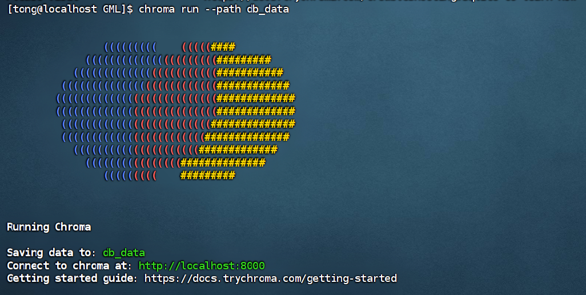
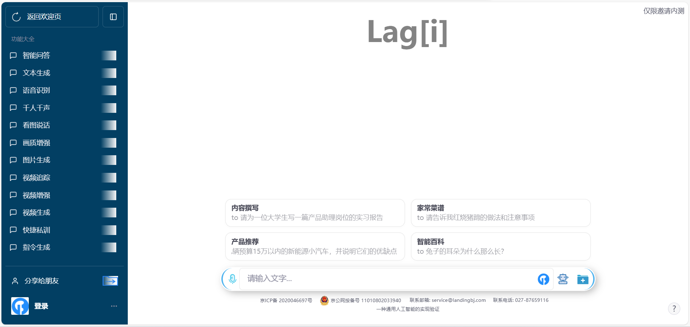
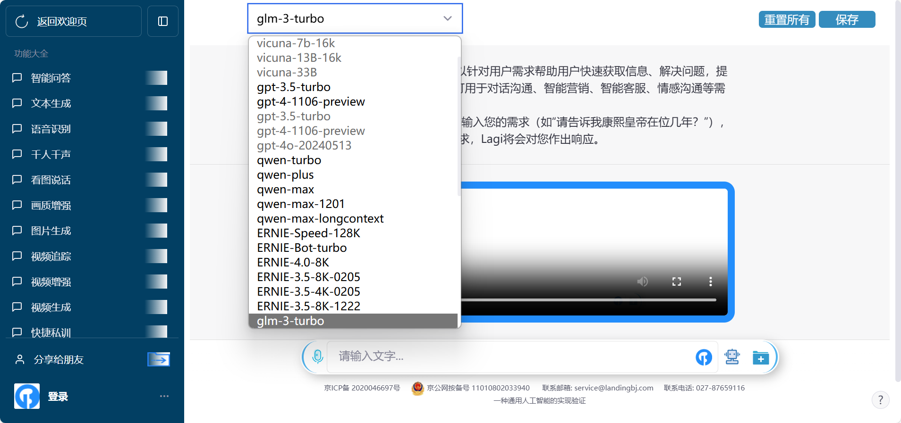

# Tutorial

Lag[i] (Landing AGI) is a powerful enterprise-class composite multimodal big model middleware that helps you easily integrate big model technology into your business. This tutorial will guide you through the download, installation, configuration and operation of Lag[i] from scratch, so that you can quickly grasp the use of Lag[i].

## Environment preparation

Before you start, make sure you have the following environments ready:

*   **Java 8 or later**
*   **Maven**
*   **Docker (Optional, used to run vector database)**

## 1. Download Lag[i] (Landing AGI)

For developers, we provide an easy way to compile and run Lag[i] (Landing AGI) applications. You can choose to use the maven command-line tool for wrapping, or run it through a popular integrated development environment (IDE) such as IntelliJ IDEA.

### Method 1: Use maven command

1. **Cloning project**：First, you need to clone the repository for the Lag[i] (Landing AGI) project:

```shell
git clone https://github.com/landingbj/lagi.git
```
2. **Go to project**：Change to the project directory:

```shell
cd lagi
```

3. **Build the project**：Run the Maven command in the project root to build:

```bash
mvn clean install
```

### Method 2: Use an IDE

1. **Choose an IDE**： You can choose to use a mainstream IDE like IntelliJ IDEA or Eclipse.

2. **Open GitHub repository**：Connect Lag[i] (Landing AGI) 's GitHub repository in IDE and use the clone function of IDE to clone Lag[i] (Landing AGI) project locally.

|        | GitHub repository                             | 
|--------|---------------------------------------| 
| SSH    | git@github.com:landingbj/lagi.git     |
| HTTPS  | https://github.com/landingbj/lagi.git | 

3. **Compile project**： Using the compile feature of your IDE, compile Lag[i] (Landing AGI) project.

## 2. Installing Vector database

Lag[i] (Landing AGI) supports several vector databases, such as ChromaDB. If you want to enhance RAG functionality with retrieval, you need to install the vector database.  

**Take ChromaDB for example**:

### Option 1: Python

***Make sure you have a Python environment installed***

- Install chromadb

```bash
    pip install chromadb
```

- Create the database storage directory

```bash
    mkdir db_data
```

- Starting the database service

```bash
    # --The path argument allows us to specify the data persistence path
    # Port 8000 is enabled by default
    chroma run --path db_data
```

**Note：**

Error when importing chromadb because sqlite3 version is too low

>RuntimeError: Your system has an unsupported version of sqlite3. Chroma requires sqlite3 >= 3.35.0.

Follow these steps

- 1.Install pysqlite3-binary

```bash
pip install pysqlite3-binary
```

- 2.When importing the chromadb package, overwrite the sqlite3 library to find your chromadb source edit `__init__.py` file

```bash
vim xxx/chromadb/__init__.py
```
- 3.Add three lines of code at the beginning

```text
__import__('pysqlite3')
import sys
sys.modules['sqlite3'] = sys.modules.pop('pysqlite3')
```

- 4.Starting the database service
  

The installation is complete, you can access via a browser: http://localhost:8000/docs see if started successfully.

chromadb：


## 3. Configure yml files

Modify the `lagi.yml` config file, select your preferred model, Replace the model's `your-api-key` and other information with your own key, and set the `enable` field to `true` for enabled models as needed.

***Example configuration kimi:***

- Fill in the model information and enable the model, changing enable to true.

    ```yaml
      - name: kimi
        type: Moonshot
        enable: true
        model: moonshot-v1-8k,moonshot-v1-32k,moonshot-v1-128k
        driver: ai.llm.adapter.impl.MoonshotAdapter
        api_key: your-api-key
    ```

- Depending on your needs, set the mode stream and the priority of the model output, the higher the priority.

    ```yaml
      chat:
        - backend: doubao
          model: doubao-pro-4k
          enable: true
          stream: true
          priority: 160
    
        - backend: kimi
          model: moonshot-v1-8k
          enable: true
          stream: true
          priority: 150
    ```

Select the configured vector database and fill in the corresponding configuration information.

***Example configuring local chromadb:***

- Replace the url with the chromadb url : http://localhost:8000.

    ```yaml
      vectors:
        - name: chroma
          driver: ai.vector.impl.ChromaVectorStore
          default_category: default
          similarity_top_k: 10
          similarity_cutoff: 0.5
          parent_depth: 1
          child_depth: 1
          url: http://localhost:8000
    
      rag:
        - backend: chroma
          enable: true
          priority: 10
    ```

## 4. Import dependencies

To call the lag[i] (Landing AGI) API, you need to import the dependencies, which you can import via maven or directly by import the jar.

***Take the maven import as an example：***

- Use maven to download the dependency execution command.

    ```shell
    mvn clean install
    ```

## 5. Start the web service.

You can choose to use the maven command-line tool for wrapping, or run it through a popular integrated development environment (IDE) such as IntelliJ IDEA.

***Example maven command encapsulation:***

- 1.Use the maven command to wrap the project, which will generate a war file in the `target` directory.

    ```shell
    mvn package
    ```

- 2.Deploy to Web server: Deploy the packaged files to a Web server.

     Tomcat:
     > Copy the WAR file into Tomcat's webapps directory.

Deploy the generated war package to the Tomcat server. After starting Tomcat, you can view the Lag[i] (Landing AGI) page by visiting the corresponding port in your browser.

For example: local port 8080：http://localhost:8080/

Local access:


## 6. Testing lags [i]

Using the browser to visit Lag[i] (Landing AGI) page, you can use the provided sample code or API interface to test, such as text dialogue, speech recognition, text-to-speech, image generation and other functions.

Text Dialogue:


## 7. Model switching

Lag[i] (Landing AGI) provides the ability to switch models dynamically. You can set up multiple models in the configuration file and select different models to switch according to your needs.

1.Modify the configuration switching model.

- Change the `lagi.yml` config file to set `enable` to `true` the model you want to use. When the current service is down under non-streaming calls, other models are automatically enabled based on the `priority` value.

```shell
    - backend: chatglm
      model: glm-3-turbo
      enable: true
      stream: true
      priority: 10

    - backend: ernie
      model: ERNIE-Speed-128K
      enable: false
      stream: true
      priority: 10
```

2.Switch models online and choose the one you like.

Online switching:


## 8. Extension

If you are not satisfied with the large model or vector database that Lag[i] (Landing AGI) has adapted，You can refer to [Extension documentation](extend_cn.md)，Extend Lag[i] (Landing AGI) to fit your favorite large model or vector database.

## 9. Training the model

You can integrate internal data information into Lag[i] (Landing AGI) by uploading question-answer pairs, thereby customizing the training of a dedicated large model. During the model training process, the `distance` represents the similarity between your question and the uploaded question-answer pairs; the smaller the value, the higher the similarity. If the most matching question-answer pair identified by the model does not align with the actual intent of your question, you can further optimize the model’s performance by adding or deleting question-answer pairs. By continuously adjusting and optimizing your question-answer data, you can gradually enhance the model’s understanding of your questions, thus improving the accuracy of the system.

### 1.Upload data

You can use the `POST /training/pairing` endpoint to upload your own Q&A pairs.

| Name         | Position | Type     | Required | Description  |
|--------------|-------|--------------------|---------|---------|
| category    | body  | string             | true    | The specified data class |
| data         | body  | [object] or object | true    | Question and answer pairs of data, supporting objects or lists of objects  |
| 》instruction | body  | string             | true    | The problem     |
| 》output      | body  | string             | true    | The answer     |

Example request is as follows(one to one):

```json
{
    "category": "default",
    "data": {
        "instruction": "What are the steps in the whole process of reapplying for a doctor's practice certificate?",
        "output": "The process of reapplying for medical practice certificate includes five steps: declaration/receipt, acceptance, decision, certification and issuance."
    }
}
```

Example batch request is as follows(one to one):

```json
{
    "category": "default",
    "data": [
        {
            "instruction": "What are the steps in the whole process of reapplying for a doctor's practice certificate?",
            "output": "The process of reapplying for medical practice certificate includes five steps: declaration/receipt, acceptance, decision, certification and issuance."
        },
        {
            "instruction": "The process of reapplying for medical practice certificate includes five steps:  declaration/receipt, acceptance, decision, certification and issuance.",
            "output": "The process of reapplying for medical practice certificate includes five steps: declaration/receipt, acceptance, decision, certification and issuance."
        }
    ]
}
```

Example request is as follows(many to one):

```json
{
    "category": "default",
    "data": [
        {
            "instruction": [
                "What are the steps in the whole process of reapplying for a doctor's practice certificate?",
                "What are the links in the process of reapplying for doctor's practice certificate?"
            ],
            "output": "The process of reapplying for medical practice certificate includes five steps: declaration/receipt, acceptance, decision, certification and issuance."
        }
    ]
}
```

Return list:

```json
{
    "status": "success"
}
```

Return the data structure:

| Name | Type | required | Description |
|---------|----------|-------|-------------|
| result  | boolean  | true  | Upload the status of the private training file   |


### 2.verification

If there is a discrepancy between the model’s response and your answer, you can use the `POST /v1/vector/query` interface to view your answer.

example request is as follows:

```json
{
    "text": "Where can I leave my luggage?", 
    "n": 6,
    "where": {},
    "category": "default"
}
```

| Name | location | type               | required | Description |
|----------|------|--------------------|----------|---------|
| text     | body | string             | true     | The problem      |
| n        | body | integer            | true     | Number of responses   |
| where    | body | [object] or object | true     | Condition      |
| category | body | string             | true     | The specified data class |

Return list:

```json
{
  "data": [
    {
      "document": "Where can I leave my luggage?\n",
      "id": "a5a74ace0f7d4339b52feb8900c6dc77",
      "metadata": {
        "category": "default",
        "level": "user"
      },
      "distance": 0.041246016
    },
    {
      "document": "Where can I leave my luggage?\n",
      "id": "16061c3e59344544987806ed457285a2",
      "metadata": {
        "category": "default",
        "level": "user"
      },
      "distance": 0.22894014
    },
    {
      "document": "What are the requirements for luggage storage\n",
      "id": "80a5d0abcf804e16b0227c95e48c671e",
      "metadata": {
        "category": "default",
        "level": "user"
      },
      "distance": 0.31431544
    },
    {
      "document": "How long can I keep my luggage\n",
      "id": "1aceb011d1c947e6acfdf8c7d389c852",
      "metadata": {
        "category": "default",
        "level": "user"
      },
      "distance": 0.3469293
    },
    {
      "document": "How much do you charge for luggage storage\n",
      "id": "ace15a4357a24b5aa2af148847f3e757",
      "metadata": {
        "category": "default",
        "level": "user"
      },
      "distance": 0.36549693
    },
    {
      "document": "Hello, the luggage storage will be charged according to the size of your luggage. According to the size, there are 10, 15, 20 yuan per piece. Storage for 24 hours a day, less than 24 hours according to 24 hours, specific charges subject to the site. Inflammable, explosive, corrosive, radioactive and other dangerous goods shall not be stored. Valuables such as computers with a single value of more than 2000 yuan, perishable and perishable live objects, power banks, lithium batteries, urns, etc. will not be stored.",
      "id": "f6c500e9f8814e6089fe90b640777165",
      "metadata": {
        "category": "default",
        "level": "user",
        "parent_id": "ace15a4357a24b5aa2af148847f3e757"
      },
      "distance": 0.36806005
    }
  ],
  "status": "success"
}
```

Return the data structure:

| Name        | Type     | required | Description |
|-------------|----------|------|------------------------|
| data        | [object] | true | A list of selections       |
| status      | string   | true | Service status code      |
| 》document   | string   | true | The hit problem                   |
| 》id         | string   | true | The data id                  |
| 》distance   | flat     | true | Vector distance              |
| 》metadata   | [object] | true | Uploading object information                 |
| 》》category  | string   | true | The specified data class               |
| 》》level     | string   | true | Upload role              |
| 》》parent_id | string   | false | The id of the question to which this answer corresponds (usually only appears in an answer) |


### 3.Questions and Answers Removed

If certain Q&A pairs are irrelevant to your overall question set or of lower quality, you can remove them from the dataset using the `POST /v1/vector/deleteByld` interface to avoid any negative impact on model training.

Example request is as follows:

```json
{
    "category":"default",
    "ids":[
        "a4ac6c2511e94a54b454f1daaa270ee5"
    ]
}
```

Request data structure:

| Name | location | type | required | Description |
|----------|------|----------------|----------|---------|
| category | body | string         | true     | The specified data class |
| ids      | body | List< string > | true     | Data id set  |

Return list:

```json
{
    "status": "success"
}
```

Return the data structure:

| Name | Type | required | Description |
|---------|----------|----------|---|
| status  | string   | true     | Service status code|

### 4.Private training Q&A optimization

You can improve the model's understanding of your questions and thus enhance system accuracy through methods such as improving data quality, optimizing question-answer matching, adjusting hyperparameters, continuous monitoring, and updates.

2. **Improving Data Quality**

   Data cleaning: Ensure the quality of the training dataset by removing invalid, erroneous, or duplicate data to enhance data accuracy.

   Data preprocessing: Standardize text, perform stemming or lemmatization to enhance the diversity and representativeness of questions, ensuring coverage of various scenarios and contexts to improve the model's generalization ability.

2. **Question answer pair matching**

   Increasing relevance: Ensure the correlation between questions and answers, avoiding irrelevant or low-quality question-answer pairs. This can involve adding or removing related question data based on similarity distance.

   Balancing data distribution: Balance the distribution of different categories of questions and answers to avoid over-concentration in any one category. This may involve adding or removing related question data accordingly.

4. **Tuning hyperparameters**

   Hyperparameter tuning: Improve the performance and stability of the model by tuning the hyperparameters of the model.

   For example:   
   The hyperparameter temperature, when close to 0, causes the model's output distribution to become more concentrated, favoring the highest-probability outputs, thereby making generated text or decisions more certain and predictable. As temperature approaches infinity, the model's output distribution becomes more uniform, resulting in greater diversity and randomness.

   Iterative training: The performance of the model is gradually optimized through multiple iterations of training.

4. **Tuning hyperparameters**

   Continuous monitoring and updates: Regularly monitor the model's performance in practical applications, and promptly update the model or training data to address data obsolescence issues.

## Summary

With this tutorial, you have successfully integrated Lag[i] (Landing AGI) into your project and can start using the various AI features Lag[i] (Landing AGI) provides. Lag[i] (Landing AGI) 's power and flexible scalability can help you easily apply big model technology to your business, improving user experience and efficiency.