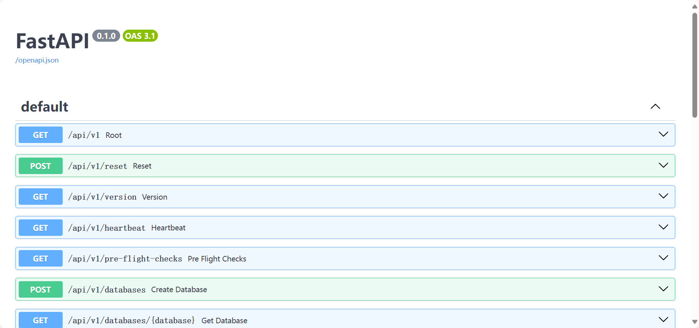

# 教学演示

Lag[i] 是一款强大的企业级复合多模态大模型中间件，它可以帮助您轻松地将大模型技术集成到您的业务中。本教程将引导您从零开始，完成 Lag[i] 的下载、安装、配置和运行，让您快速掌握 Lag[i] 的使用方法。

## 环境准备

在开始之前，请确保您已经准备好以下环境：

*   **Java 8 或更高版本**
*   **Maven**
*   **Docker (可选，用于运行向量数据库)**

## 1. 下载 Lag[i]

对于开发者而言，我们提供了简便的方法来编译和运行Lag[i]应用。您可以选择使用maven命令行工具进行封包，或者通过IntelliJ IDEA等主流的集成开发环境（IDE）进行运行。

### 方法一：使用maven命令

1. **克隆项目**：首先，您需要克隆Lag[i]项目的仓库:

```shell
git clone https://github.com/landingbj/lagi.git
```
2. **进入项目**：切换到项目目录：

```shell
cd lagi
```

3. **编译项目**：在项目根目录下运行 Maven 命令进行编译：

```bash
mvn clean install
```

### 方法二：使用IDE

1. **选择 IDE**： 您可以选择使用 IntelliJ IDEA 或 Eclipse 等主流 IDE。

2. **打开 GitHub 仓库**：在 IDE 中连接 Lag[i] 的 GitHub 仓库，使用 IDE 的克隆功能，将 Lag[i] 项目克隆到本地。

|        | GitHub 仓库                             | 
|--------|---------------------------------------| 
| SSH    | git@github.com:landingbj/lagi.git     |
| HTTPS  | https://github.com/landingbj/lagi.git | 

3. **编译项目**： 使用 IDE 的编译功能，编译 Lag[i] 项目。

## 2. 安装向量数据库 

Lag[i] 支持多种向量数据库，例如 ChromaDB。如果您想使用检索增强 RAG 功能，需要安装向量数据库。

**以 ChromaDB 为例**:

### 方式一：Python

***确保有安装有Python运行环境***

- 安装chromadb

```bash
    pip install chromadb
```

- 创建数据库存储目录

```bash
    mkdir db_data
```

- 启动数据库服务

```bash
    # --path参数可以指定数据持久化路径
    # 默认开启8000端口
    chroma run --path db_data
```

### 方式二：Docker

***确保有安装有Docker运行环境***

- 运行以下命令,拉取安装并启动chromadb。

```bash
    # 启动Chroma数据库容器
    #
    # 该命令用于在Docker中启动一个名为Chroma的数据库服务容器。它通过一系列参数配置容器的运行环境和对外服务。
    # 参数解释：
    # -d: 后台运行容器并返回容器ID。
    # --name: 为容器指定一个名称，便于后续管理和识别。
    # -p: 容器内部端口与主机端口的映射，这里将容器的8000端口映射到主机的8000端口。
    # -v: 容器内部目录与主机目录的绑定，实现数据的持久化存储。这里将主机的/mydata/docker/local/chroma/data目录绑定到容器的/study/ai/chroma目录。
    # -e: 设置环境变量，用于配置容器内部的应用程序行为。这里设置了两个环境变量：
    #     IS_PERSISTENT=TRUE 表示数据库数据将被持久化存储。
    #     ANONYMIZED_TELEMETRY=TRUE 表示允许匿名遥测数据的收集。
    # chromadb/chroma:latest: 指定使用的镜像为chromadb/chroma的最新版本。
    
    docker run -d \
    --name chromadb \
    -p 8000:8000 \
    -v /mydata/docker/local/chroma/data:/study/ai/chroma \
    -e IS_PERSISTENT=TRUE \
    -e ANONYMIZED_TELEMETRY=TRUE \
    chromadb/chroma:latest
```

安装完成，您可以通过浏览器访问：http://localhost:8000/docs 查看是否启动成功。

chromadb：


## 3.配置yml文件

修改`lagi.yml`配置文件，选择您喜欢的模型，将其中的模型的`your-api-key`等信息替换为您自己的密钥，并根据需求将启用的模型的`enable`字段设置为`true`。

***以配置kimi为列：***

- 填入模型信息并开启模型,修改enable设置为true。

    ```yaml
      - name: kimi
        type: Moonshot
        enable: true
        model: moonshot-v1-8k,moonshot-v1-32k,moonshot-v1-128k
        driver: ai.llm.adapter.impl.MoonshotAdapter
        api_key: your-api-key  
    ```

- 根据您的需求，设置模型输出的方式stream和优先级priority，值越大优先级越高。

    ```yaml
      chat:
        - backend: doubao
          model: doubao-pro-4k
          enable: true
          stream: true
          priority: 160
    
        - backend: kimi
          model: moonshot-v1-8k
          enable: true
          stream: true
          priority: 150
    ```

选择配置的向量数据库，并填入对应的配置信息。

***以配置本地chromadb为例：***

- 替换url地址为chromadb的url地址http://localhost:8000。

    ```yaml
      vectors:
        - name: chroma
          driver: ai.vector.impl.ChromaVectorStore
          default_category: default
          similarity_top_k: 10
          similarity_cutoff: 0.5
          parent_depth: 1
          child_depth: 1
          url: http://localhost:8000
    
      rag:
        - backend: chroma
          enable: true
          priority: 10
    ```

## 4.引入依赖

调用lag[i]相关API接口需引入依赖，您可以通过maven引入或直接导入jar的方式。

***以maven引入为例：***

- 使用maven下载依赖执行命令。

    ```shell
    mvn clean install
    ```

## 5.启动web服务。

您可以选择使用maven命令行工具进行封包，或者通过IntelliJ IDEA等主流的集成开发环境（IDE）进行运行。

***以maven命令行工具封包为例：***

- 1.使用maven命令进行项目封包，封包完成后将会在`target`目录下生成一个war文件。

    ```shell
    mvn package
    ```

  - 2.部署到 Web 服务器: 将打包后的文件部署到 Web 服务器中。  
  
  Tomcat:
  > 将 WAR 文件复制到 Tomcat 的 webapps 目录中。

将生成的war包部署到Tomcat服务器中。启动Tomcat后，通过浏览器访问对应的端口，即可查看Lag[i]的具体页面。

例如：本地8080端口：http://localhost:8080/

本地访问：


## 6. 测试 Lag[i]

使用浏览器访问 Lag[i] 页面，您可以使用提供的示例代码或 API 接口进行测试，例如文本对话、语音识别、文字转语音、图片生成等功能。

文本对话：


## 7. 模型切换

Lag[i] 提供了动态切换模型的功能，您可以在配置文件中设置多个模型，并根据需求选择不同的模型进行切换。

1.修改配置切换模型。

- 通过修改`lagi.yml`配置文件，将需要使用的模型设置为`enable`为`true`。在非流式调用下当前服务宕机，会根据`priority`值自动启用其他模型。

```shell
    - backend: chatglm
      model: glm-3-turbo
      enable: true
      stream: true
      priority: 10

    - backend: ernie
      model: ERNIE-Speed-128K
      enable: false
      stream: true
      priority: 10
```

2.在线切换模型，选择您喜欢的模型。

在线切换：


## 8. 自由扩展

如果您对 Lag[i] 已适配的大模型或向量数据库不满意，您可以参考[扩展文档](extend_cn.md)，对 Lag[i] 进行扩展，适配您喜欢的大模型或向量数据库。

## 总结

通过本教程，您已经成功地将 Lag[i] 集成到您的项目中，并可以开始使用 Lag[i] 提供的各种 AI 功能。Lag[i] 的强大功能和灵活的扩展性可以帮助您轻松地将大模型技术应用到您的业务中，提升用户体验和效率。
